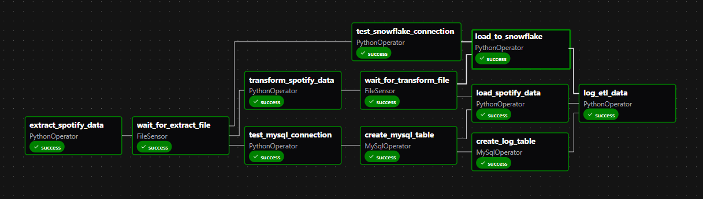

# spotify_etl_airflow
Spotify ETL project orchestrated through Aiflow running in docker.

A complete data engineering project that extracts Spotify listening data, transforms it, and loads it into both MySQL and Snowflake databases. The pipeline is orchestrated using Apache Airflow and allows user to use the data for visualizations.

## 🚀 Project Overview

This project implements an end-to-end ETL (Extract, Transform, Load) pipeline that:
- Extracts recent Spotify listening data from Spotify Web API
- Transforms and cleans the data for analysis
- Loads data into both MySQL (local) and Snowflake (cloud) databases
- Orchestrates the entire process using Apache Airflow running in Docker
- Provides analytics through a Power BI dashboard

## PowerBI dashboard 
A dashboard I created utilizing the data loaded into snowflake, using Direct Query in PowerBI

<!-- Add your Power BI dashboard screenshot here -->


## Airflow Directed Acyclic Graph
A DAG representing the data pipeline

<!-- Add your DAG screenshot here -->


## Setup Instructions
### Prerequisites
1. Docker installation
2. Apache Airflow installation (Docker will handle this)
3. MySQL database
4. Snowflake account
5. Spotify Developer account (generate client_id and client_secret)

### requirements.txt
- apache-airflow-providers-postgres==5.11.0 
- apache-airflow-providers-http==4.5.0
- apache-airflow-providers-mysql==5.3.0
- apache-airflow-providers-snowflake==6.5.4 
- mysqlclient
- spotipy==2.25.1
- python-dotenv==1.1.1

## Installation
### Step 1: Clone the repository
### Step 2: Airflow-init
From within the root of the project directory, run:
```docker compose up airflow-init```
This might take a while

### Step 3: Docker Compose
run:
```docker compose up -d```

### Step 4: Access Airflow UI
Within your web browser, type in the URL:
```localhost:8080```

### Step 5: Set Up Connections in Airflow UI
1. FS default
- connection Id: fs_default
- connection type: File(path)
- extra fields JSON: { "path": "{\"path\": \"/\"}"}

2. Snowflake
[first setup you snowflake account if you don't have one yet]
- connectin Id: snowflake_spotify
- connection type: Snowflake
- login, password and schema : [your account details]

3. MySQL
[first, create a MySQL user for Airflow]

```sql
CREATE DATABASE spotify_db; 
CREATE USER 'airflow_user'@'%' IDENTIFIED BY 'airflow_pass'; 
GRANT ALL PRIVILEGES ON coffee_db.* TO 'airflow_user'@'%'; 
FLUSH PRIVILEGES;
```

- connection Id: mysql_spotify
- connection type: MySQL
- host: host.docker.internal
- login : airflow_user
- password: airflow_pass
- port: 3306
- schema: [put database name which you have created for the project] eg. spotify_db

### Step 6: Restart the Airflow containers
```docker compose down```
```docker compose up -d```

### Step 7: Trigger Dag
Within the Airflow UI, navigate into the "Dags" section, and find 
```spotify_data_pipeline```