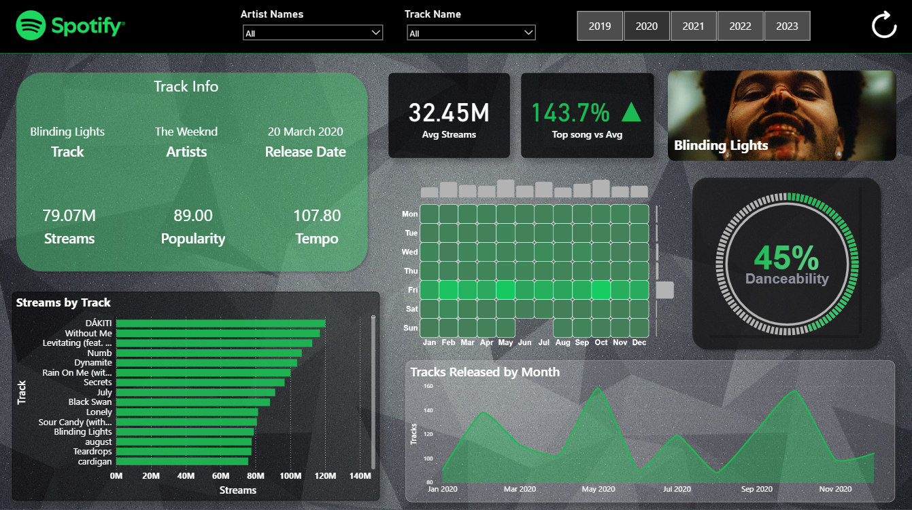

# spotify_etl_airflow
Spotify ETL project orchestrated through Aiflow running in docker.

A complete data engineering project that extracts Spotify listening data, transforms it, and loads it into both MySQL and Snowflake databases. The pipeline is orchestrated using Apache Airflow and allows user to use the data for visualizations.

## PowerBI dashboard 
<!-- Add your Power BI dashboard screenshot here -->

